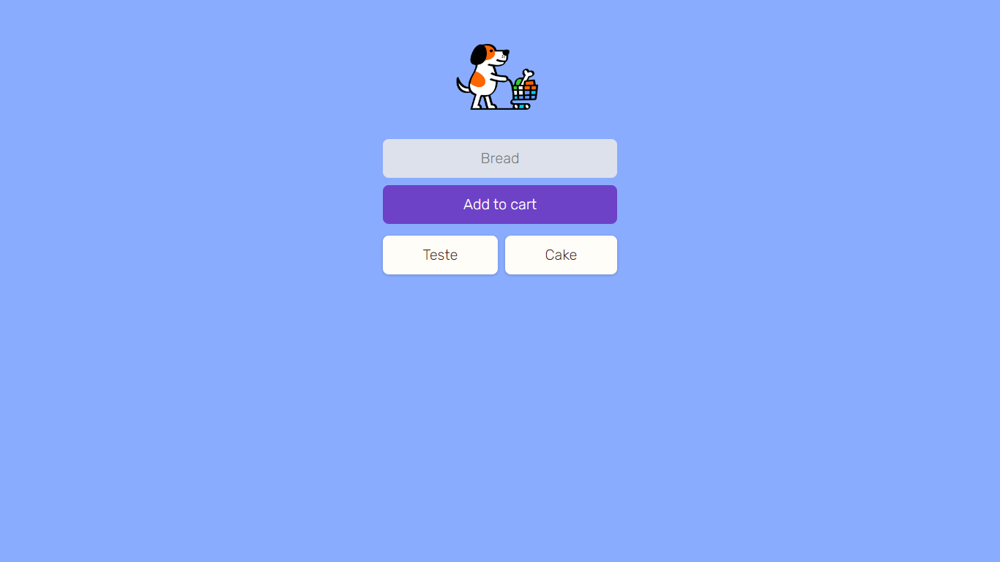

# Add to cart app

## 🚀 The app

- The **Add to cart app** is a PWA (Progressive Web App) created to add shooping items to your cart.
- Built with HTML, CSS and Javascript
- It uses Firebase

## ☕ The app

- You can use it to store items simply by typing the item name and clicking on the "Add to cart" button.
- Delete the items by clicking on each one of them.
- Open the app <a href="https://add-to-cart-isaacvf.netlify.app/" target="_blank">link</a> on your android or iphone and click 'Add to Home Screen'

## 🤝 Author

<table>
  <tr>
    <td align="center">
      <a href="https://github.com/Isaacvf-dev">
         
        
          <b>Isaac Vieira</b>
        
      </a>
    </td>    
  </tr>
</table>
